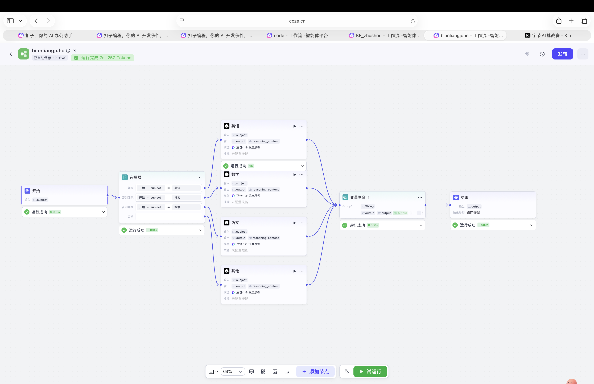

# Coze Subject Knowledge Generator

基于 Coze 工作流搭建的学科知识点生成系统。

用户输入不同科目（英语 / 数学 / 语文 / 其他）后，
系统会自动调用对应 AI 节点，
生成该学科的知识点内容与学习总结。

---

## Features

- 学科分类识别
- 多节点 AI 内容生成
- 自动汇总知识点
- 支持英语 / 数学 / 语文 / 其他科目
- Coze 工作流可直接导入使用

---

## Workflow Structure

```text
开始
↓
选择器（判断科目）
↓
不同学科 AI 节点
↓
变量聚合
↓
结果输出
```

---

## Workflow Screenshot


